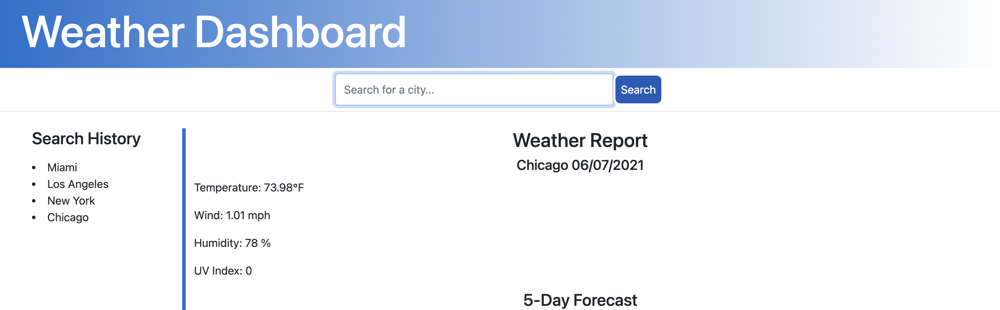

# Weather Dashboard

## Description:
This application will allow the user to enter a location(city) of their choice, and obtain the current day's weather conditions, along with a 5-day forecast. Each time the user enters a city, it'll be saved into a search history section(local storage), which the user will be able to access at will.

## Process:
- Created a HTML, CSS and JS files
- Linked all files accordingly
- Created divs for all rows and columns
- Formatted all applicable classes to "row" so I could later format to a GRID layout
- Added moment.js on javascript file to display the current day and date on the header
- Linked all third-party APIs, including Open Weather, Moment.js Bootstrap, jQuery, and Font Awesome
- Created function to obtain current temperature, wind speed, humidity and UV index
- Created function where recently searched cities will be rendered on the Search History section
- Created function to dynamically generated cards for a five-day forecast
- Created an alert that will be trigerred should the user not enter a city on the search bar

## Usage:

- Link to application: https://agonzalvez.github.io/weather-report/
- App screenshot(s): 